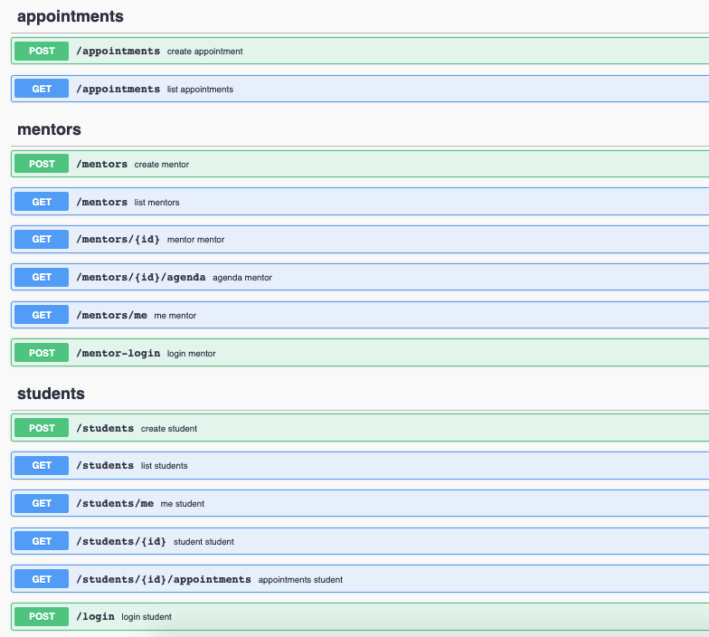
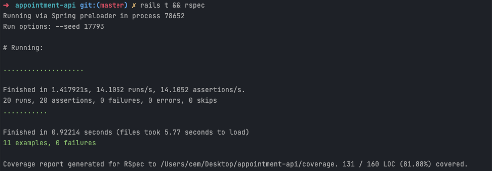

# Student Mentor Appointment API

 => https://appointment-api-rails.herokuapp.com


### How to run

Firstly, edit **docker-compose.yml** and set ENV variables. After that,

```
docker-compose up -d
```

```
docker-compose run web rails db:create 
```

 ```
docker-compose run web rails db:migrate 
```

### Swagger EndPoint

```
/api-docs
```  




#### Postman DOC
```
https://documenter.getpostman.com/view/3721602/TzRREUMW
```

#### Postman Collection
```
{project_folder}/api-V1.postman_collection.json
```

### Code Coverage Output
```
{project_folder}/coverage/index.html
``` 
Note : when you run rspec tests, code coverage report will updated.




### Running Tests

##### Running model tests

```
docker-compose run web bundle exec rails test

or 

docker-compose run web bash
rails t

```

##### Running controller tests

```
docker-compose run web bundle exec rspec

or 

docker-compose run web bash
rspec
```

#### Development Decisions

- Used **PostgreSQL** as a database. Because in this project we need relational database.
- Used byebug to debug easily
- Used **JSON web token (JWT)** for authentication
- Used **rswag, rspec-rails, rspec_api_documentation** to use Swagger and RSPEC
- Used **rack-cors** to allow all request sources
- Used **simplecov** to calculate test coverage

#### To Do

- Admin dashboard (active admin, administrate etc.)
